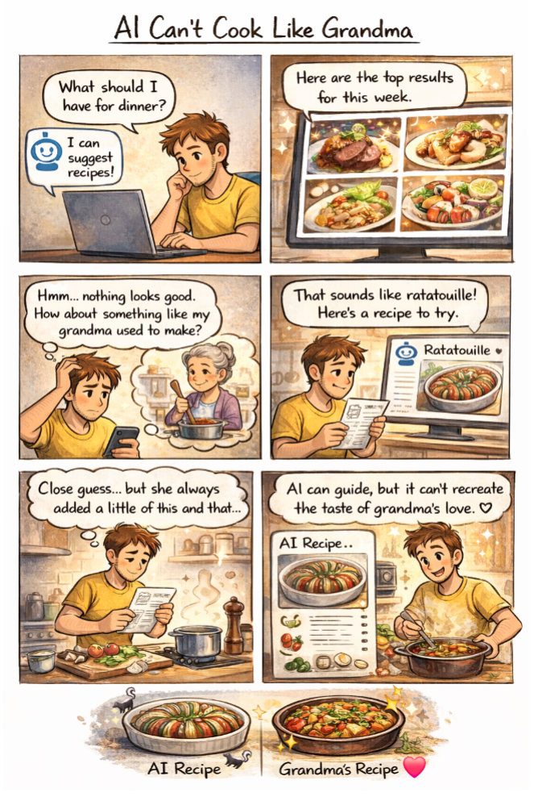

# Week 4 – Comic & Storytelling

## The Artifact
# Comic Description
Panel 1
A hungry person asks an AI to give them recipe recommendations:
    *“What should I have for dinner?”*
Panel 2
The AI shows pictures of complex dishes seen all over social media.
    *“Here are the top results for this week.”*
Panel 3
The person frowns, not liking any of the suggestions.
    ```markdown
    *“Hmm…Nothing looks good. How about something like my grandma used to make?”*
Panel 4
The AI gives another, more personalized recommendation.
    ```markdown
    *“That sounds like ratatouille! Here’s a recipe to try.”*
Panel 5
The person reads the recipe, but changes seasoning to taste, and adds different vegetables to better fit their grandma’s cooking
    ```markdown 
    *“Close guess, but she always added a little of this and that…”*
Panel 6
A side by side comparison of the AI ratatouille recipe and the much better looking Grandma’s ratatouille recipe.
    ```markdown 
    *“AI can guide, but it can’t recreate the taste of grandma’s love.”*


AI generated comic depicting a man struggling to decide what to have for dinner. AI helps him choose, but ultimately, he is reminded that AI can't compare to his grandmother's cooking.

## Process Notes
How did you make this?
What tools did you use?
What decisions did you make?

## Reflection
I was attempting to show through this comic that AI cannot bring the same meaning to a task that a human’s creative liberty can. From the beginning, the AI’s tendency to regurgitate patterns is clear, since it shows current trending recipes filled with expensive ingredients rather than something more reasonable for the everyday. AI does, however, guide the person to what they had originally wanted: grandma’s ratatouille. While the AI recipe is perfect and follows all of the normal ratatouille conventions, the person takes over control of the task by deviating from the recipe, adding in all of the ‘imperfections’ that remind him of his grandma’s cooking. The end result holds much more personal meaning than if he had followed the AI recipe to a T.

Using the comic format was a new experience for me, and it forced me to cut out all of the clutter I usually find in my essays (I tend to ramble). The short panel count made me focus more on the core of my idea, and I was able to fully flesh out what it meant to me. Because of this constraint, I found myself not wanting to use AI for the story at all since I had it covered. However, prompting DallE for the images did take a lot of revision. Color contrast and facial expressions had to be reiterated over and over to get my desired effect.

In the end, I truly felt that I had taken full advantage of AI as a guide when creating this Make. As the judge and jury (if not also the executioner at some times), I was able to shape a collection of otherwise meaningless AI generated images into something that tells a meaningful story.


## Attribution & AI Use
- Tools used: DALL·E
- AI prompts (summary): "Create a 6 panel comic that illustrates how AI cannot recreate 'grandma's cooking' on its own."
- What AI generated: Images in a comic format
- What you changed or decided: Storyline, text formatting, color constract, speech bubbles, and panel layout.