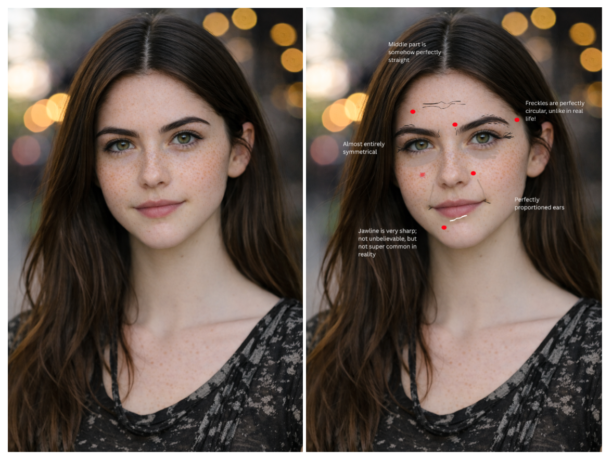

# Selfies & Identity

### Image 1: AI-Generated Selfie
A young woman with smooth/unblemished skin smiles softly at the viewer. The face is nearly symmetrical save for a small difference in the eyebrows; the face has no imperfections at all. The background is blurred but could be a street scene/outdoor seating of a cafe.

### Image 2: Remixed Selfie
Notes detail the uncanniness of the ‘perfect’ AI image. I drew common human ‘imperfections’ like wrinkles, eye bags, unplucked brows, acne, and a scar under the lip. The before and after shows the uniqueness every flaw brings to a person’s face.

## Reflection
When describing myself to the image generator, I was struggling to find the right words to express how I saw myself. Brown hair, hazel eyes, pale skin. The first image looked like a dime a dozen damsel from a dime novel. Coaxing a few more details into the image–freckles, fuller brows, middle part–still didn’t feel right. The freckles were perfect geometric circles, the brows stayed stubbornly apart no matter how much I prodded the AI to bring them closer together, and the middle part was straighter than I could ever get my own. Someone that could be a distant cousin who models for Vogue looked back at me, instead of myself.

What I lack in editing skills, I (hopefully) make up for in description. The image generator refused to make a ‘flawed’ portrait no matter how hard I tried, so I went back and added them myself. Faint wrinkles from a life of smiles and laughter, stubborn eye bags that cling on no matter how healthy my sleep schedule is, a scar under my lip from a childhood slip and fall, my ever present war against acne, and infuriatingly unkempt eyebrows that try to grow into a unibrow despite my best efforts.

One is definitely more ‘me’ than the other. The familiarity of my flaws feels much more comfortable than Ms. Vogue the model. No matter how many words I use to describe myself to an AI, it can only cobble together something that only superficially looks like me based off of faces it already has data of. In a sense, the AI made a realistic portrait, while I chose to impose my true sense of self on the edited image through expressing the little differences that bring out my unique features, just like the art of kintsugi that enhances the flaws of its vessel.

## Attribution & AI Use
- Tools used: DALL·E 
- AI prompts (summary): “Photorealistic portrait of an early 20s woman with long, dark hair, hazel eyes, freckles, and a blurred background.”
- What AI generated: Initial portrait image
- What you changed or decided: Edited the portrait in Canva to add common human flaws (acne/wrinkles) and notes detailing the uncanny perfect/model-like qualities of the image.
- Note: I did not upload a real photo of myself to the AI system