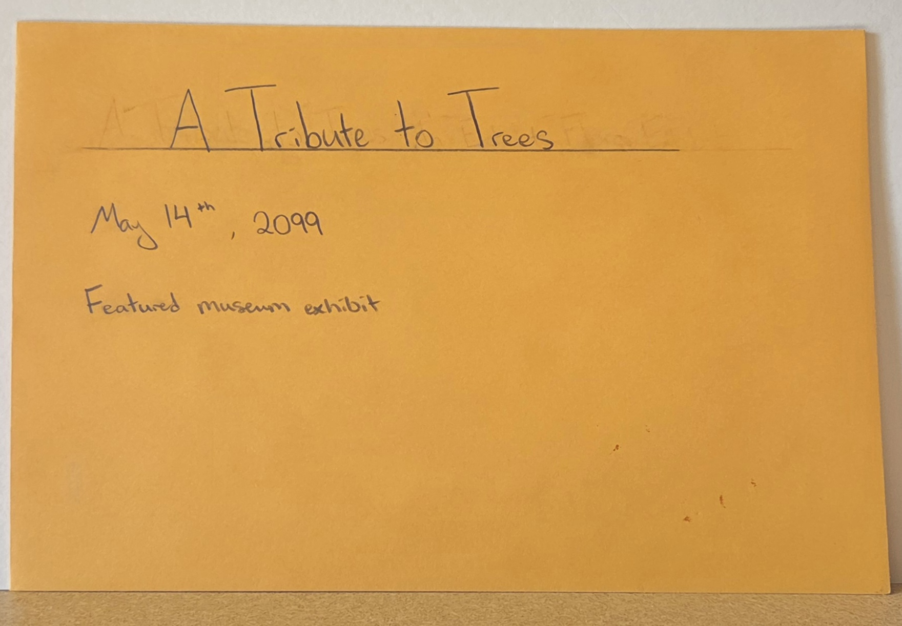

Futures of AI & Humanity

## The Artifact

## Context Statement
This artifact depicts a featured museum exhibit on May 14th, 2099. By this year, AI has been fully integrated into every facet of society and daily life. However, this came at a cost; early AI from the 2010s to the 2040s was built and controlled by capitalistic and profit driven corporations. These corporations cared little about the effects their greed had on the environment, and continued extraction operations until the International AI Treaty of 2048 forcibly put an end to it. The damage had already been done, and the effects were dire. Corporations had led clear cutting operations to create more mining sites, metals and rare earth minerals to build GPUs and other AI infrastructure. Data centers had been built around every street corner to run their bots. Between the clear cutting and toxic runoff from the mines to the water shortages and air pollution from the data centers, nature was on its last legs. Featured in the exhibit are what is left of once-common flora specimens from the Midwest of the United States (now the People’s Democracy). These preserved specimens are largely not intact, and scientists have filled in the missing pieces with their best rendition of what we believed they looked like. In the past, humanity decided to turn a blind eye to the suffering of the natural world; not just corporations, but every user and bystander, as well. It is only thanks to activists that we still have 5 species of live trees today. Efforts are continuing to reintroduce them to the outside and increase their biodiversity.

This future is shaped by present-day trends of rapid AI expansion and limited regulation of both environmental impacts and corporate power. The prioritization of innovation and convenience over sustainability, alongside public dependence on AI tools, allowed these systems to scale without consequence. Early warnings about energy consumption, resource extraction, and environmental degradation were acknowledged but largely ignored in favor of profit growth and technological improvements.
The artifact reveals an assumption that human-AI relations are not inherently harmful, but are mediated by the systems of power (like corporations and governments) that control AI development. Rather than AI itself causing collapse, it is human reliance, corporate control, and collective inaction that drive environmental destruction. At the same time, the existence of preserved leaves and 5 living species suggests that AI, if governed responsibly, could exist sustainably.

## Reflection
In my unprofessional opinion, this future is both likely and undesirable. AI is currently in a boom; much like the industrial revolution, it is expanding at a pace most people can barely keep up with. And again, much like that era, we often fail to recognize the full environmental consequences until they are nearly irreversible. Innovation tends to outpace regulation and caution. Still, that does not mean this outcome is unavoidable. While some damage has already been done, further harm can be prevented. Unlike during the industrial revolution, we now have access to advanced technology and information/networking. We are aware of the risks: energy use, resource extraction, and pollution, and we now have the tools to respond. The challenge is getting everyone to work together on a large scale. Global cooperation would be great, if possible, but it really only needs a few countries to get kickstarted. Thinking of the space race and the AI race, usually once one global power hops on the train of the next best thing, everyone else rushes to join them.

This is a snapshot of the dangerous nature of the present: a willingness to trade sustainability for convenience and profit. Companies continue expanding AI systems despite known environmental costs, and consumers accept these systems without questioning consequences. Early warning signs are there (sea level rise, droughts, heatwaves, etc.) yet they rarely drive meaningful change, reflecting the ongoing pattern of delayed response to environmental crises.

This future becomes more and more likely as these current trends continue; weak regulation, profit-driven development, and public complacency. To avoid it, governments must enforce strict environmental regulations, companies must prioritize sustainability over profitability, and individuals must demand transparency and make more responsible choices regarding AI use.

## Attribution & AI Use
- Tools used: None
- AI prompts (summary): None
- What AI generated: None